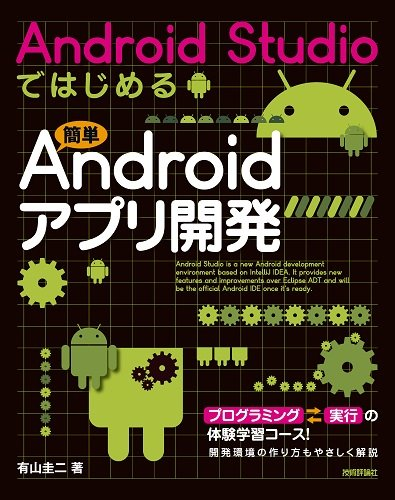
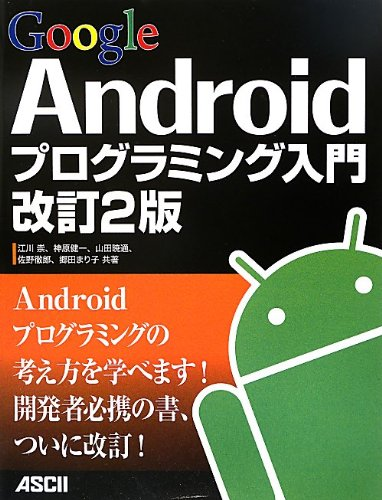
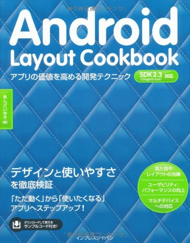
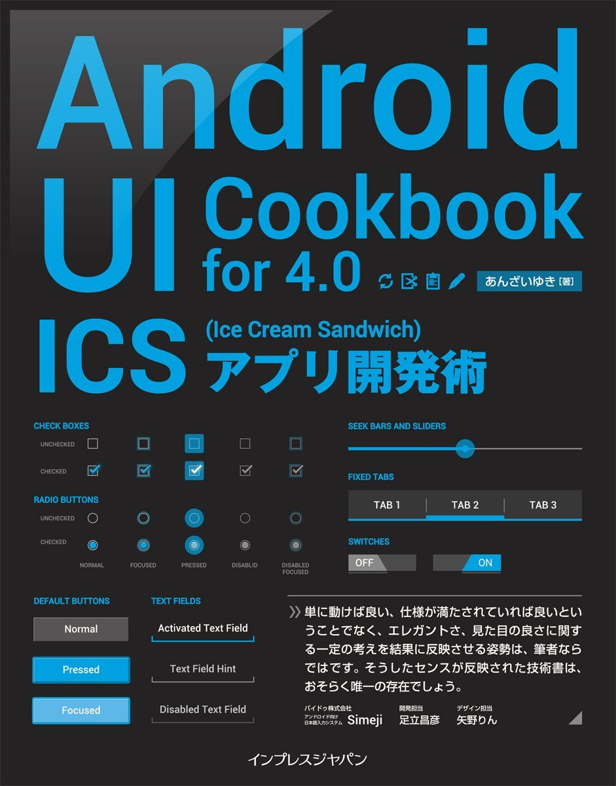

footer: 2015/09/12
slidenumbers: true
autoscale: true

# Android開発 技術情報

### 2015/09/12 小俣 博司

---
**目次**

* Andoirdアプリ開発環境
* Andoird Studioについて
* Java JDK
* 無料オンライン動画学習
* 無料オンライン動画学習 (AndroidとJavaのページ)
* 公式サイト
* Andoridアプリのリリース
* 参考Webサイト
* Android Studioのインストール方法
* 東北TECH道場 ドキュメント&サンプルソースコード
* 参考書図書 1〜4
* 関連知識
* [郡山道場の情報サイト][1]
* プログラミングの上達のコツ
* プログラミングに役に立つサイト

[1]: https://github.com/koriyamadojo/

---
# Andoirdアプリ開発環境

* Android Studio
	- Androidアプリを開発するための統合環境
* Java JDK
	- Androidアプリを開発のプログラミング言語
	- Java7 JDK 以上
* Android端末
	- AndroidのOSが載った端末
	- パソコンで動作するシミュレーター
		+ Android Studioに付属しています
* パソコン
	- Windows7 以上
	- Mac OSX

----
# Andoird Studioについて

Android Studioは、Androidアプリを開発するための統合環境でAndoridの開発者サイトから無料でダウンロード出来ます.

- [Android Studio IDE　ダウンロード](https://developer.android.com/sdk/index.html)

----
# Java JDK

JDKとは、Java言語でプログラミングを行う際に必要なソフトウェアのセット。
Javaの開発元であるSun Microsystems社(現在はOracle社)が開発、配布している。
コンパイラやデバッガ、クラスライブラリ、Javaプログラム実行環境(Java仮想マシン（JVM：Java Virtual Machine）)などが含まれる。

Java JDK(Java Development Kit)は、Javaプログラム言語でプログラミングするための開発環境と実行環境です。Oracle社のWebサイトより無料でダウンロード出来ます。

JRE(Java Runtime Environment)はJavaプログラム実行環境(Java仮想マシン)だけなのでこちらは使用しません。またEdition等が沢山ありますが、SE(Standard Editon)を使用します

- [Java SE Development Kit 8 ダウンロード](http://www.oracle.com/technetwork/java/javase/downloads/jdk8-downloads-2133151.html)

---
# 無料オンライン動画学習

無料で学習できるオンライン動画学習サイトを活用すると便利です。

**[ドットインストール](http://dotinstall.com/lessons/basic_android_v2)**
入り口としてさわり程度の学習には最適なサイトです。ここで全体イメージを把握してから他を学習すると良いと思います。

**[UDACITY](https://www.udacity.com/)**
無料で、最新のテクノロジーを学ぶことができるアメリカ発のオンライン学習サービスです。
GoogleやAT&T、Intuitといった企業と協力して、最新のトピックをカバーしているのが大きな特徴です。
基本英語の動画ですが、日本語字幕があるので安心です

* [UDACITY on Edmaps](http://edmaps.co/udacity/)
	- 株式会社リクルートホールディングス（以下リクルート）がUdacity, Inc.との協力により運営されている日本語ガイドサイト。

---
### 無料オンライン動画学習 (AndroidとJavaのページ)

**ドットインストール**

* [Androidアプリ開発入門](http://dotinstall.com/lessons/basic_android_v2)
* [Java入門 ](http://dotinstall.com/lessons/basic_java)

**UDACITY**
* [Android Development for Beginners](https://www.udacity.com/course/viewer#!/c-ud837/l-4027328704/)
* [Developing Android Apps](https://www.udacity.com/course/viewer#!/c-ud853/l-1395568821)
	- [Androidアプリの開発](https://edmaps.co/lectures/976?locale=ja)
* [Intro to Java Programming](https://www.udacity.com/course/viewer#!/c-cs046/l-176475143)

---
# 公式サイト

**Android関連**

* [Android開発者向けサイト](http://developer.android.com/intl/ja/index.html)
* [GooglePlay デベロッパーコンソール登録](https://play.google.com/apps/publish/)
	- [Google Play](https://play.google.com/store?hl=ja)

**Java関連**

* [Java SE API & ドキュメント](http://www.oracle.com/technetwork/jp/java/javase/documentation/api-jsp-316041-ja.html)
	- [Java8 コア API ドキュメント](http://docs.oracle.com/javase/jp/8/docs/api/)
	- [Java8 JDK プログラマーズ・ガイド](http://docs.oracle.com/javase/jp/8/)

---
# Andoridアプリのリリース
Andoridアプリのリリースは、Google Playにアップロードします。
その為に、GooglePlayデベロッパーコンソールに、開発者登録が必要になります。
また、Google Play Developerへの開発者登録は有料です。

**開発者登録のについて**

* 登録料は25ドル(3000円くらい)が必要
* 月額ではなく、初回登録時に1回支払うだけ
* 登録にはクレジットカードが必要です
	- VisaプリペイドカードのVプリカで代用可能
* Googleアカウントが必要
* GooglePlayデベロッパーコンソールの登録処理が完了するまで48時間ほどかかることがある

**開発者登録サイト***

* [GooglePlay デベロッパーコンソール登録](https://play.google.com/apps/publish/)

---
# 参考Webサイト

アプリ開発の情報はインターネットに沢山あります。
自分に合った物を探すとよいかとは思いますが、難しいもの、情報が古い、間違った情報がありますので、注意が必要です。

まずは入り口をして、良さそうなWebサイトをご紹介します。

* [ソフトウェア技術ドキュメントを勝手に翻訳](http://www.techdoctranslator.com/android)
* [逆引きAndroid入門](http://www.adakoda.com/android/)
* [Tech Institute アプリ開発者養成講座テキスト](http://techinstitute.jp/material/01/)
	- [講座概要（シラバス）全６５回](http://tokyo.techinstitute.jp/syllabus.php)
	- [第1期　教材テキスト　正誤表](http://techinstitute.jp/material/01/errata.php)

---
# Android Studioのインストール方法

Android Studioのインストール方法についても何個がピックアップをしました。
一番わかりやすいサイトを参考にしてみてください

* [初心者でもできる！「AndroidStudio」を使ったAndroidアプリ開発環境の構築方法](http://techacademy.jp/magazine/5238)
* [開発環境の構築ステップを完全図解～Android StudioからはじめるAndroidアプリ開発:その1【初心者向けアプリ開発3分tips】](http://engineer.typemag.jp/article/ra-android-tips05)
* [Android Studio最速入門～効率的にコーディングするための使い方](http://gihyo.jp/dev/serial/01/android_studio)
* [初心者でもできる！「AndroidStudio」を使ったAndroidアプリ開発環境の構築方法](http://techacademy.jp/magazine/5238)

---
# 東北TECH道場 ドキュメント

東北TECH道場で過去に作成したドキュメントです

* [TTD_Androidアプリ開発の基礎](https://docs.google.com/presentation/d/1tQZ0CIGjr8VYQolR-TYG13LWTMvOTU_K2aJ2LEfpD4w/edit#slide=id.p)
* [予習](http://www.tohokutechdojo.org/preparation.html)
*  [東北TECH道場 プログラミングの基本](https://docs.google.com/presentation/d/1L42iCsWH1UxDxivsSbMxNPetB1ydr1TJusRf3tAqN_k/edit?usp=sharing)
* [東北TECH道場 プログラミングの基本（絵と音）](https://docs.google.com/document/d/1Bd9fJMtfgQmlIN7yVNeQdHpp1zNKS2ZS8tFUCVh-H_w/edit?pli=1)
* [東北TECH道場-より良いコードの書き方](https://docs.google.com/presentation/d/15B5BSXWQw1-dcZVYzy46PrRt7L0d6xqdwy_X4gFcrdk/edit?hl=ja&forcehl=1#slide=id.p)

---
# 東北TECH道場 サンプルソースコード

* [その１ 未来へのキオク API に Android アプリケーションからアクセスするためのサンプルソースです](https://docs.google.com/document/d/1O7BDQIazQrgIChXavp_HwJNHt9rZz0AppMhgyCBLt2o/edit)
* [その２ サンプルソースの拡張です](https://docs.google.com/document/d/1HpSxbTvGeW8zNEEgG8LHrVVO73TGmL2S0nQ23QSmsjs/edit)
* [その３ サンプルでマップを表示する機能拡張です](https://docs.google.com/document/d/1TKY4Vn-Ds4RY8ShUGpEuKG-w0TODnHHZ4fu5ov7ZUuM/edit)
* [その４ 現在地の情報を取得する機能拡張です](https://docs.google.com/document/d/1eW9izR5nCrjhY0OHVZIIMhKoEz_V8rPbOnwX0AJ6A4U/edit)
* [その他 仙台道場ー石巻道場の距離を計算して表示するサンプルアプリです。](https://docs.google.com/document/pub?id=1D16qztwKBLyHOYT2HhinoOCRG6wu2oky-wa0uBcY2NQ)

---
# 参考書図書1

Android Studioで開発する入門書です

* [Android Studioではじめる 簡単Androidアプリ開発](http://www.amazon.co.jp/dp/4774169986/)
* [「Android Studioではじめる簡単Androidアプリ開発」補足資料](http://keiji.github.io/the-androidstudio-book/archives/book.pdf)

---
# 参考書図書2

情報は少し古いですが、Android開発の基本的な事はこちらを参考にすると良いでしょう。

* [Androidプログラミング入門 改定2版](http://www.amazon.co.jp/dp/4048860682/)

---
# 参考書図書3

情報は古いですが、Androidのレイアウトの考え方を詳しく説明されてます

* [Android Layout Cookbook - アプリの価値を高める開発テクニック](http://www.amazon.co.jp/dp/4844329871/)

---
# 参考書図書4

Android 4.0以上の開発のUI(User Interface)については参考になります
サンプルコードがありはネットからダウンロードできます

* [Android UI Cookbook for 4.0　ICS（Ice Cream Sandwich）アプリ開発術](http://www.amazon.co.jp/dp/B00AEIAF9O/)

---
# 関連知識

なくてもアプリ開発出来ますが、知識としてあるとより開発効率が上がります

* Git (GitHub)
	- プログラムのソースコードの履歴や管理をするツール
	- [ドットインストール - git入門 (全22回)](http://dotinstall.com/lessons/basic_git)
* Atom
	- プログラミングをする為のソースコードを入力するエディタ
	- Android Studio以外で作業するときに便利です
	- [ドットインストール - Atom入門 (全13回)](http://dotinstall.com/lessons/basic_atom)

---
# 郡山道場の情報サイト

郡山道場では、ファイル等の共有には、GitHubを利用します。
必要な時にはこちらを参照ください

* [東北TECH道場 郡山道場 - GitHubページ](https://github.com/koriyamadojo/)

---
# プログラミングの上達のコツ
* 似たようなプログラムを探す
* 他の人が作成したプログラムを読む
* 似たようなサンプルコードを探す
	- 動作するプログラムを変更する
* インターネットで調べまくる
	- 英語が最新情報
	- 英語は読めるようになること
* ドキュメントを読む
	- どこを読めば良いかを整理しておく
	- 辞書を引くイメージです
* 相談をする
	- 自分の現在の状況を整理する
	- 自分の開発環境は？
	- 何に困っているのか？
	- 何を教えて欲しいのか？

---
# プログラミングに役に立つサイト

**プログラマの技術情報共有サービス**
* [Qiita](https://qiita.com/)
* stackoverflow　(スタック・オーバーフロー)
	- [本家：英語](http://stackoverflow.com/)
	- [ 日本語サイト](http://ja.stackoverflow.com/)
**Java**
* [Android開発を目指す人のためのJava超入門](http://libro.tuyano.com/index3?id=495001)
* [Javaプログラミング講座](http://java.it-manual.com/start/)
* [Java入門](http://dotinstall.com/lessons/basic_java)

**Android**
* [Develop Apps | Android Developers](http://developer.android.com/intl/ja/develop/index.html)
* [世界を目指せ！Androidアプリ開発入門](http://gihyo.jp/dev/serial/01/androidapp)
* [Y.A.M の 雑記帳](http://y-anz-m.blogspot.jp/)

---

# [fit] The End
